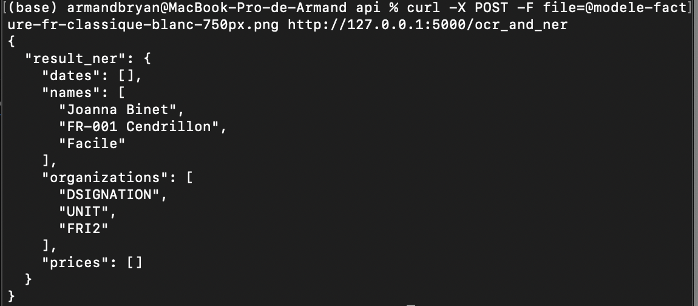

# API Documentation

An API (Application Programming Interface) is a set of protocols, routines, and tools for building software and applications. It allows developers to interact with the functionalities or data of an operating system, application, or another service.

For this project, I decided to build an API to perform specific tasks related to image processing and natural language understanding.

## Installation

To set up the environment and install the necessary dependencies, use the following command:

```bash
pip install -r requirements.txt
```

## Project Overview

### Subject

The objective of this project is to develop an API that takes an image as input and extracts key information such as names, dates, organizations, monetary values, and more. The process is divided into three main steps:

1. **Perform Optical Character Recognition (OCR)**: Convert the textual content within the image into a machine-readable format.
2. **Perform Named Entity Recognition (NER)**: Identify and classify entities in the text such as names of persons, organizations, dates, and monetary values.
3. **Build the API**: Integrate the OCR and NER functionalities into a cohesive API that outputs the processed data in a structured format.

All outputs are formatted in JSON, which is ideal for data storage and is also compatible with API responses.

## API Usage

### Testing the API

To test the API, use the following `curl` command:

```bash
curl -X POST -F file=@modele-facture-fr-classique-blanc-750px.png http://127.0.0.1:5000/ocr_and_ner
```

Don't forget to run the flask server before

### Expected Output

The API will return the extracted information in JSON format, which may include:

- **Text**: The raw text extracted from the image.
- **Entities**: Key information such as names, dates, organizations, and monetary values identified by the NER model.

### Example Output

Below is an example of the API output, demonstrating the extracted text and recognized entities:

```json
{
    "text": "Sample text extracted from the image",
    "entities": [
        {
            "entity": "John Doe",
            "type": "PERSON",
            "confidence": 0.98
        },
        {
            "entity": "01/01/2022",
            "type": "DATE",
            "confidence": 0.95
        },
        {
            "entity": "Company XYZ",
            "type": "ORGANIZATION",
            "confidence": 0.92
        },
        {
            "entity": "$1000",
            "type": "MONEY",
            "confidence": 0.88
        }
    ]
}
```

### Performance Notes

The OCR model achieves high accuracy in text extraction, while the NER model's predictions may require further fine-tuning to achieve optimal performance. The NER model's current performance, while functional, does not yet reach an excellent level of precision and may benefit from additional training and model adjustments.

